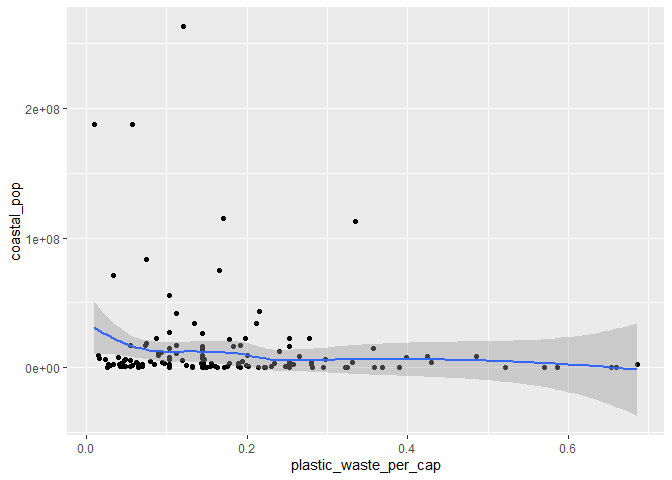

Plastic pollution is a major and growing problem, negatively affecting oceans and wildlife health. [Our World in Data](https://ourworldindata.org/plastic-pollution) has a lot of great data at various levels including globally, per country, and over time. For this lab we focus on data from 2010.

Additionally, National Geographic recently ran a data visualization communication contest on plastic waste as seen [here](https://www.nationalgeographic.org/funding-opportunities/innovation-challenges/plastic/dataviz/).

Learning goals for this lab are:

- Visualize numerical and categorical data.
- Recreate visualizations.
- Get more practice using R Studio with Git and GitHub.

## Getting started

Click on the link emailed to you to create your Lab 02 repo, which should be named `lab-02-plastic-waste-YOUR_GITHUB_USERNAME`. Copy the URL of the repo, and use it to create an RStudio project. Refer to Lab 01 if you would like to see step-by-step instructions for cloning a repo into an RStudio project.

First, open the R Markdown document `lab-02-plastic-waste.Rmd` and Knit it. Make sure it compiles without errors. The output will be in the file markdown `.md` file and the `.html` file in your project directory.

This document uses the `emo` package.  If you have not done so previously, you will need to install this package by running the following commands in the Console:

```r
install.packages("devtools")
devtools::install_github("hadley/emo")
```


### Packages

We'll use the **tidyverse** package for this analysis:


```r
library(tidyverse)
```

## The data

The dataset for this assignment can be found as a csv file in the `data` folder of your repository. You can read it in using the following.


```r
plastic_waste <- read_csv("data/plastic-waste.csv")
```

The variable descriptions are as follows:

- `code`: 3 Letter country code
- `entity`: Country name
- `continent`: Continent name
- `year`: Year
- `gdp_per_cap`: GDP per capita constant 2011 international $, rate
- `plastic_waste_per_cap`: Daily plastic waste generation per capita, measured in kg per person per day
- `mismanaged_plastic_waste_per_cap`: Amount of mismanaged plastic waste (littered or improperly disposed) per capita, measured in kg per person per day
- `mismanaged_plastic_waste`: Tonnes of mismanaged plastic waste
- `coastal_pop`: Number of individuals living on/near coast
- `total_pop`: Total population according to Gapminder

## Exercises

Let's start by taking a look at the distribution of plastic waste per capita in 2010.


```r
ggplot(data = plastic_waste, aes(x = plastic_waste_per_cap)) +
  geom_histogram(binwidth = 0.2)
```

```
## Warning: Removed 51 rows containing non-finite values (`stat_bin()`).
```

<!-- -->

One country stands out as an unusual observation at the top of the distribution. One way of identifying this country is to filter the data for countries where plastic waste per capita is greater than 3.5 kg/person per day.


```r
plastic_waste %>%
  filter(plastic_waste_per_cap > 3.5)
```

```
## # A tibble: 1 × 10
##   code  entity     conti…¹  year gdp_p…² plast…³ misma…⁴ misma…⁵ coast…⁶ total…⁷
##   <chr> <chr>      <chr>   <dbl>   <dbl>   <dbl>   <dbl>   <dbl>   <dbl>   <dbl>
## 1 TTO   Trinidad … North …  2010  31261.     3.6    0.19   94066 1358433 1341465
## # … with abbreviated variable names ¹​continent, ²​gdp_per_cap,
## #   ³​plastic_waste_per_cap, ⁴​mismanaged_plastic_waste_per_cap,
## #   ⁵​mismanaged_plastic_waste, ⁶​coastal_pop, ⁷​total_pop
```

Did you expect this result? Later, you might consider doing some research on Trinidad and Tobago to see why plastic waste per capita is so high there, or whether this is a data error.

**From this point onwards the plots / output of the code won't be evaluated or printed in the lab, but you can run the code and view the results below by setting eval = TRUE in the global option that is set at the very beginning of this document (after the YAML).**

1. Plot, using histograms, the distribution of plastic waste per capita faceted by continent.


```r
ggplot(data = plastic_waste,
       mapping = aes(x = plastic_waste_per_cap)) +
  geom_histogram() +
  facet_wrap(~ continent)
```

```
## `stat_bin()` using `bins = 30`. Pick better value with `binwidth`.
```

```
## Warning: Removed 51 rows containing non-finite values (`stat_bin()`).
```

<!-- -->


2.  Next, use box plots to compare the distribution of plastic waster per capita by continent.  Below is some code to filter the data to exclude the high outlier. Use this filtered dataset, `plastic_waste_filtered`, for your box plots.  (If you are curious, try constructing your box plots using the unfiltered dataset and see how they look!)   What can you say about how the continents compare to each other in terms of their plastic waste per capita?  Use correct statistical terminology in your response, and be sure to address the shape, center, and spread of the distributions.


```r
plastic_waste_filtered <- plastic_waste %>%
  filter(plastic_waste_per_cap < 3.5)
```


```r
ggplot(data = plastic_waste_filtered, 
       mapping = aes(x = plastic_waste_per_cap, y = continent)) + 
    geom_boxplot()
```

<!-- -->

 What can you say about how the continents compare to each other in terms of their plastic waste per capita?  Use correct statistical terminology in your response, and be sure to address the shape, center, and spread of the distributions.
 
  **Europe and Asia share similar distributions as the majority of their observations are both  right skewed with medians of about 0.15 to 0.19. Asia, however, does have a high outlier compared to Europe creating a really large range for Asia. North America has an interesting distribution compared to the other continets as seen in its high median value of about 0.25 and many high outliers. However, the middle 50% of North America's observations do fall close to other continents' middle 50% of observations. Although, Africa has the lowest IQR and the smallest overall range of values, meaning Africa has the lowest plastic waster per capita. Moreover, Africa's median value is around 0.4 and it has a somewhat right skewed distribution.**
  
3. Convert your side-by-side box plots to violin plots. Make the violin plot for each continent a different color.  What do the violin plots reveal that box plots do not? What features are apparent in the box plots but not in the violin plots?


```r
ggplot(data = plastic_waste_filtered, 
       mapping = aes(x = plastic_waste_per_cap, y = continent, color = continent)) + 
    geom_violin()
```

<!-- -->

**It is much easier to see the overall range of values for plastic_waste_per_cap in the violin plot. It is also much easier to see where the majority (or minority) of observations fall for each continent's plastic waster per capita in how the violon plots grow wider in some areas than other areas. **

4.  Another way of visualizing numerical data is using density plots:


```r
ggplot(data = plastic_waste_filtered, aes(x = plastic_waste_per_cap)) +
  geom_density()
```

<!-- -->

We can compare distributions across continents by coloring density curves by continent:


```r
ggplot(data = plastic_waste_filtered, 
       mapping = aes(x = plastic_waste_per_cap, 
                     color = continent)) +
  geom_density()
```

<!-- -->

The resulting plot may be a little difficult to read, so let's also fill the curves in with color:


```r
ggplot(data = plastic_waste_filtered, 
       mapping = aes(x = plastic_waste_per_cap, 
                     color = continent, 
                     fill = continent)) +
  geom_density()
```

<!-- -->

The overlapping colors make it difficult to tell what's happening with the distributions for each continent since they are plotted on top of each other. We can change the transparency level of the fill color to help with this. The `alpha` argument takes values between 0 and 1, where 0 is completely transparent and 1 is completely opaque. There is no way to tell what value will work best, so you just need to try a few.


```r
ggplot(data = plastic_waste_filtered, 
       mapping = aes(x = plastic_waste_per_cap, 
                     color = continent, 
                     fill = continent)) +
  geom_density(alpha = 0.7)
```

<!-- -->

This still doesn't look great...

Recreate the density plots above using a different (lower) alpha level that works better for displaying the density curves for all continents.


```r
ggplot(data = plastic_waste_filtered, 
       mapping = aes(x = plastic_waste_per_cap, 
                     color = continent, 
                     fill = continent)) +
  geom_density(alpha = 0.3)
```

<!-- -->


5. Describe why we defined the `color` and `fill` of the curves by mapping aesthetics of the plot but we defined the `alpha` level as a characteristic of the plotting geom.

  **By applying `color` and `fill` to the mapping aesthetics, r applies those `color` and `fill` specifications to all layers of the visualization and applies those specifications based on the actual values in the dataset. When we define `alpha` in geom_density, it will only be applied to the density plot. This local specification of `alpha` allows users to add other layers that won't be affected by the `alpha`. In addition, the benefit of using `alpha` in the geom_density means the `alpha` specification isn't based on any values in the dataset. **

✅ ⬆️ *Now is a good time to commit and push your changes to GitHub with an appropriate commit message. Make sure to commit and push all changed files so that your Git pane is cleared up afterwards.*


6. Visualize the relationship between plastic waste per capita and mismanaged plastic waste per capita for the filtered dataset using a scatterplot. Describe the relationship.


```r
ggplot(data = plastic_waste_filtered, 
       mapping = aes(x = plastic_waste_per_cap,
                     y = mismanaged_plastic_waste_per_cap)) +
       geom_point(color = "blue")
```

<!-- -->
  **It appears that there is a weak positive correlation between plastic_waste_per_cap and mismanaged_plastic_waste_per_cap based on the very scattered but upward direction of the points.**

7. Color the points in the scatterplot by continent. Does there seem to be any clear distinctions between continents with respect to how plastic waste per capita and mismanaged plastic waste per capita are associated?


```r
ggplot(data = plastic_waste_filtered, 
       mapping = aes(x = plastic_waste_per_cap,
                     y = mismanaged_plastic_waste_per_cap, 
                     color = continent)) +
       geom_point()
```

<!-- -->

**There are distinctions in plastic waste based on continent. One can see this in how the points representing Europe remain in a very general range of 0.05kg per person per day whereas Asia's points representing this relationship vary greatly. In some cases, Asia's mismanaged_plastic_waste_per_cap is around 0.1kg per person per day and 0.3 or about 0.22kg per person in other cases.**

8. Visualize the relationship between plastic waste per capita and total population as well as plastic waste per capita and coastal population for the filtered dataset. Do either of these pairs of variables appear to be more strongly linearly associated?  You might consider adding `geom_smooth()` as a layer to your plot to help visualize the relationships.


```r
ggplot(data = plastic_waste_filtered, 
       mapping = aes(x = plastic_waste_per_cap,
                     y = total_pop)) +
       geom_point() +
       geom_smooth()
```

```
## `geom_smooth()` using method = 'loess' and formula = 'y ~ x'
```

```
## Warning: Removed 10 rows containing non-finite values (`stat_smooth()`).
```

```
## Warning: Removed 10 rows containing missing values (`geom_point()`).
```

<!-- -->


```r
ggplot(data = plastic_waste_filtered, 
       mapping = aes(x = plastic_waste_per_cap,
                     y = coastal_pop)) +
       geom_point() +
       geom_smooth()      
```

```
## `geom_smooth()` using method = 'loess' and formula = 'y ~ x'
```

<!-- -->
**There is not a strong distinction between the coastal_pop's distribution and the total_pop's distribution. Both of them have similar strength linear relationships.** 

✅ ⬆️ *Now is another good time to commit and push your changes to GitHub with an appropriate commit message. Make sure to commit and push all changed files so that your Git pane is cleared up afterwards.*


9. Recreate the plot below, and interpret what you see in context of the data.  The x-axis is a calculated variable and the one country with plastic waste per capita over 3 kg/day has been filtered out.  I have completed the filtering step for you in the starter code below.  (We will learn about creating new variables and filtering data in the next unit.)  Note:  you do not have to specify a dataset in the ggplot command (the way the code is written, the filtered dataset will be passed to the ggplot function). The data in the graph below are not only represented with points on the plot, but also with a smooth curve. The term “smooth” should help you pick which geom to use.  See the `ggplot` reference link on Brightspace under Content -> Resources.  The colors are from the viridis color palette.  Search the functions starting with `scale_color_viridis_*` for more information.  You should use the function `scale_color_viridis_d()` as a layer in your graph to display the points using a discrete color scale.  The plot also uses `theme_minimal()`, which should be added as a layer to the plot.    


```r
plastic_waste %>% 
  mutate(coastal_pop_prop = coastal_pop / total_pop) %>%
  filter(plastic_waste_per_cap < 3) %>%
  ggplot(mapping = aes(x = coastal_pop_prop,
                       y = plastic_waste_per_cap, color = continent)) +
  geom_point() +
  geom_smooth(color = "black") +
  scale_colour_viridis_d() +
  labs(x = "Coastal population proportion (Coastal/total population)",
       y = "Plastic waste per capita",
       title = "Plastic waste vs. coastal population proportion",
       subtitle = "by continent") +
  theme_set(theme_minimal())
```

```
## `geom_smooth()` using method = 'loess' and formula = 'y ~ x'
```

```
## Warning: Removed 10 rows containing non-finite values (`stat_smooth()`).
```

```
## Warning: Removed 10 rows containing missing values (`geom_point()`).
```

<!-- -->

```r
# You fill in the rest
```

<!-- -->


✅ ⬆️ *Commit and push your changes to GitHub with an appropriate commit message again. Make sure to commit and push all changed files so that your Git pane is cleared up afterwards.*
