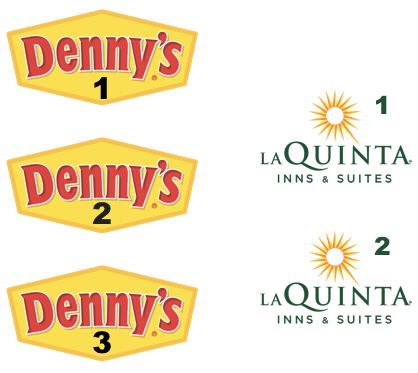
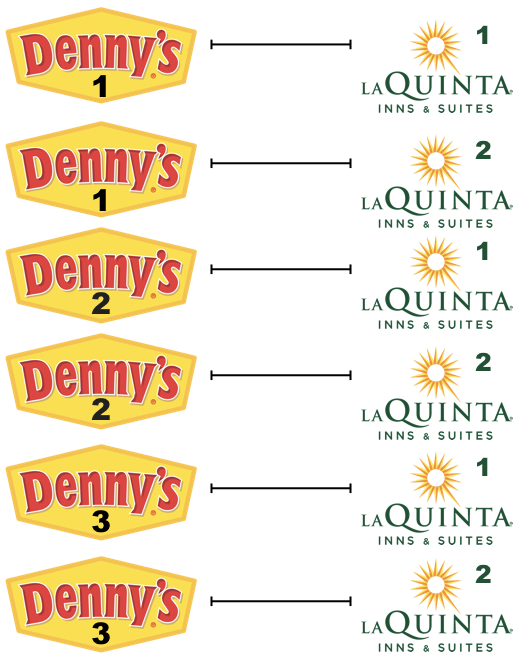

In this lab we revisit the Denny's and La Quinta Inn and Suites data we 
visualized in the previous lab.


# Packages

In this lab we will use the `tidyverse` package.

```{r message = FALSE}
library(tidyverse) 
```


# The data

The data consist of two csv (comma separated values) files: one for 
Denny's locations and the other for La Quinta.

```{r message = FALSE}
dn <- read_csv("data/dennys.csv")
lq <- read_csv("data/laquinta.csv")
```

# Exercises

1. Filter the Denny's data frame for Alaska (AK) and save the result as 
   `dn_ak`. How many Denny's locations are there in Alaska?
```{r dn filter for AK}
dn_ak <- dn %>% 
  filter(state == "AK")
  
view(dn_ak)
```

**There are three Denny's in Alaska.**

2. Filter the La Quinta data frame for Alaska (AK) and save the result 
   as `lq_ak`. How many La Quinta locations are there in Alaska?
```{r lq filter for AK}
lq_ak <- lq %>% 
  filter(state == "AK")
  
view(lq_ak)
```

**There are two LaQuinta's in Alaska.**

Next we'll calculate the distance between all Denny's and all La Quinta 
locations in Alaska. Let's take this step by step:

**Step 1:** There are 3 Denny's and 2 La Quinta locations in Alaska. 
(If you answered differently above, you might want to recheck your answers.)

{width=300px height=300px}

**Step 2:** Let's focus on the first Denny's location. We'll need to 
calculate two distances for it: (1) distance between Denny's 1 and 
La Quinta 1 and (2) distance between Denny's 1 and La Quinta 2.

{width=300px height=150px}

**Step 3:** Now let's consider all Denny's locations.

{width=300px height=450px}

3. How many pairings are there between all Denny's and all La Quinta locations
   in Alaska? That is, how many distances do we need to calculate between the 
   locations of these establishments in Alaska?
**There are 6 different distances that need to be calculated.**

In order to calculate these distances we need to first restructure our data 
to pair the Denny's and La Quinta locations. To do so, we will join the two 
data frames (by the variable `state`). We have six join options in R. Each of these join functions take 
at least three arguments: `x`, `y`, and `by`:

- `x` and `y` are data frames to join
- `by` is the variable(s) to join by

Four of these join functions (called **mutating joins**) combine variables from the two data frames:


- `inner_join()`: return all rows from `x` where there are matching values 
in `y`, and all columns from `x` and `y`.  Unmatched rows are not included in the result.

- `left_join()`: return all rows from `x`, and all columns from `x` and `y`. 
Rows in x with no match in y will have NA values in the new columns.

- `right_join()`: return all rows from `y`, and all columns from `x` and `y`. 
Rows in y with no match in x will have NA values in the new columns.

- `full_join()`: return all rows and all columns from both `x` and `y`. Where 
there are not matching values, returns NA for the one missing.

Note:  the `merge()` function in base R can perform all four types of mutating joins.  The advantage of using the `dplyr` functions is that they more clearly convey the intent of your code.  `dplyr`'s joins are also faster.

The other two join functions in `dplyr`, `semi_join()` and `anti_join()`, only keep cases from the left-hand data frame, 
and are called **filtering joins**.  
You can find out more about the join functions in the help files for any one 
of them, e.g. `?full_join`.

In practice we mostly use mutating joins. In this case we want to keep all 
rows and columns from both `dn_ak` and `lq_ak` data frames. So we will use 
a `full_join`.  We will also specify the `by` variable in the join to be `state`, since there are other common variables between the two tables.

{height=300px width=300px}

We will have duplicate keys in this case, so you might want to read the [Duplicate Keys](https://r4ds.had.co.nz/relational-data.html#join-matches) section in *R for Data Science* to understand what happens during a join when you have duplicate keys.  In the situation where both tables have duplicate keys (like we have here), you will get all possible combinations (the Cartesian product).  In our case, we are trying to match each row of the `dn_ak` table to row(s) in the `lq_ak` table.  Note that the variable `state` is the same for every row in the `lq_ak` table, so each row from the Denny's table will be matched up to every row in the La Quinta table (we will get all possible combinations of Denny's/La Quinta locations.)

Let's join the data on Denny's and La Quinta locations in Alaska, and see what it looks like:

```{r eval = TRUE}
dn_lq_ak <- full_join(dn_ak, lq_ak, by = "state")

```

4. How many observations are in the joined `dn_lq_ak` data frame? What are 
   the names of the variables in this data frame? 
  **There are six observations which makes sense since there were six distances we needed to measure. The name of the variables are address, city, zip, longitude, and latitude, and each one of them has a ".x" or ".y" at the the end of them to specify from which dataset they originally came from.**
  
`.x` in the variable names means the variable comes from the `x` data frame 
(the first argument in the `full_join` call, i.e. `dn_ak`), and `.y` means 
the variable comes from the `y` data frame. These variables are renamed to 
include `.x` and `.y` because the two data frames have the same variables 
and it's not possible to have two variables in a data frame with the exact 
same name.

Now that we have the data in the format we want, all that is left is to 
calculate the distances between the pairs.

5.  What function from the tidyverse do we use to add a new variable to 
    a data frame while keeping the existing variables?
**The mutate function**

One way of calculating the distance between any two points on the earth is 
to use the Haversine distance formula. This formula takes into account the 
fact that the earth is not flat, but instead spherical.

This function is not available in R, but we have it saved in a file called 
`haversine.R` that we can load and then use:

```{r}
haversine <- function(long1, lat1, long2, lat2, round = 3) {
  # convert to radians
  long1 = long1 * pi / 180
  lat1  = lat1  * pi / 180
  long2 = long2 * pi / 180
  lat2  = lat2  * pi / 180
  
  R = 6371 # Earth mean radius in km
  
  a = sin((lat2 - lat1)/2)^2 + cos(lat1) * cos(lat2) * sin((long2 - long1)/2)^2
  d = R * 2 * asin(sqrt(a))
  
  return( round(d,round) ) # distance in km
}
```

This function takes five arguments:

- Longitude and latitude of the first location
- Longitude and latitude of the second location
- A parameter by which to round the responses

6. Calculate the distance between all pairs of Denny's and La Quinta 
   locations and save this variable as `distance`. Use the default value of 3 for the `round` argument.  Make sure to save this variable in the `dn_lq_ak` data frame so that you can use it later.
```{r distances}
dn_lq_ak <- dn_lq_ak %>% 
  mutate(distance = haversine(longitude.x, 
                              latitude.x, 
                              longitude.y, 
                              latitude.y, 
                              round = 3))
view(dn_lq_ak)
```

7. Calculate the minimum distance between a Denny's and a La Quinta for each Denny's 
   location. To do this, group by Denny's location and then calculate a new variable 
   that stores the information for the minimum distance using `summarize()`.
```{r min distance}
dn_lq_ak %>% 
  group_by(address.x) %>% 
  summarise(minDist = min(distance))
```

**The minimum distance between a LaQuinta and a Denny's is 2.035 miles.**

8. Give summary statistics (n, mean, median, sd, min, and max) for the distribution of the distances between a Denny's location and the nearest La Quinta location in Alaska. 
```{r summary stats}
sumStats <- dn_lq_ak %>% 
  summarize(count_dist = n(),
            mean_dist = mean(distance),
            median_dist = median(distance),
            sd_dist = sd(distance),
            min_dist = min(distance),
            max_dist = max(distance))

view(sumStats)
```
   
9. Repeat the same analysis for North Carolina: (i) filter Denny's and 
   La Quinta data frames for NC, (ii) join these data frames to get a complete
   list of all possible pairings, (iii) calculate the distances between all 
   possible pairings of Denny's and La Quinta in NC, (iv) find the minimum distance 
   between each Denny's and La Quinta location, (v) visualize and 
   describe the distribution of these shortest distances using appropriate summary 
   statistics.
   
```{r nc wrangling}
dn_nc <- dn %>% 
  filter(state == "NC")

lq_nc <- lq %>% 
  filter(state == "NC")

dn_lq_nc <- full_join(dn_nc, lq_nc, by = "state")

dn_lq_nc <- dn_lq_nc %>% 
  mutate(distance = haversine(longitude.x, 
                              latitude.x, 
                              longitude.y, 
                              latitude.y, 
                              round = 3))

view(dn_lq_nc)

```

```{r nc minDist}
minNC <- dn_lq_nc %>% 
  group_by(address.x) %>% 
  summarise(minDist = min(distance))

view(minNC)
```

```{r nc visualization}
ggplot(minNC, aes(y = minDist)) +
  geom_boxplot(fill = "lightblue") +
  theme(axis.ticks.x = element_blank(),
	      axis.text.x = element_blank()) +
  labs(title = "Minimum Distance between Denny's & LaQuintas in NC", 
       y = "Minimum Distance (m)")

```

**The boxplot reveals that the middle 50% of the closest LaQuintas and Denny's range from approximately 20 miles to approximately 90 miles apart from each other. The median shortest distance between the establishments is around 60 miles. It appears that the maximum shortest distance between the establishments is around 185 miles and the minimum shortest distance between the establishments is around 5 miles.**

10. Repeat the same analysis for Texas.
```{r tx wrangling}
dn_tx <- dn %>% 
  filter(state == "TX")

lq_tx <- lq %>% 
  filter(state == "TX")

dn_lq_tx <- full_join(dn_tx, lq_tx, by = "state")

dn_lq_tx <- dn_lq_tx %>% 
  mutate(distance = haversine(longitude.x, 
                              latitude.x, 
                              longitude.y, 
                              latitude.y, 
                              round = 3))
```

```{r tx minDist}
minTX <- dn_lq_tx %>% 
  group_by(address.x) %>% 
  summarise(minDist = min(distance))

view(minTX)
```    

```{r tx visualization}
ggplot(minTX, aes(y = minDist)) +
  geom_boxplot(fill = "orange") +
  theme(axis.ticks.x = element_blank(),
	      axis.text.x = element_blank()) +
  labs(title = "Minimum Distance between Denny's & LaQuintas in TX", 
       y = "Minimum Distance (m)")

```

**The boxplot for Texas reveals that the median minimum distance between the establishments is around 4 miles. The middle 50% of the minimum distances range from around 2 miles to around 6 miles. There are some high outliers that seem to suggest the maximum shortest distance is around 61 miles.The minimum shortest distance appears to be around less than a mile.**
11. Among the states you examined, where is Mitch Hedberg's joke most likely 
    to hold true? Explain your reasoning.
**It is most likely to hold true in Texas because of how small the magnitude and range are for the middle 50% of the minimum distances. The middle 50% of minimum distances' range is only about 4 miles and are between 2 miles and 6 miles. The median minimum distance for Texas is around 4 miles. Also, what appears to be the highest outlier is around 61 miles. In contrast, North Carolina's middle 50% of minimum distances is from approximately 20 miles to approximately 90 miles apart from each other with the median minimum distance at around 60 miles. The stark difference in the IQR reveal that Texas really is the sate where Hedberg's joke stands to be more true. 
    